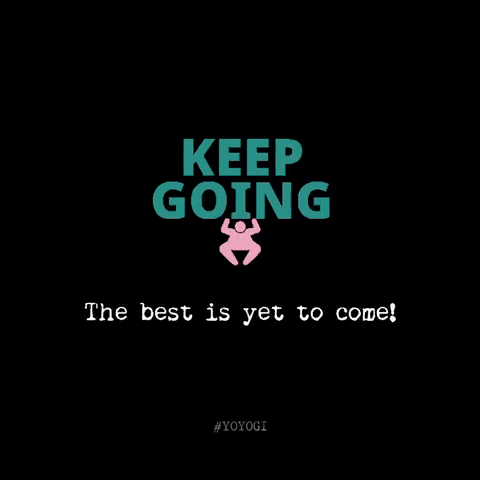

<h1>
   Hi, I'm Kevin Wang   
</h1>

- 🔭 I’m currently working on **agentic systems**, **vertical AI**, **speech synthesis** and **LLMs**.   

- 👯 I’m looking to collaborate on speech synthesis and large language models.

- 📫 How to reach me: talktalkai.kevin@gmail.com

- 🤗 My Hugging Face: [Kevin Wang](https://huggingface.co/kevinwang676) & bilibili: [永远满仓的Kevin](https://space.bilibili.com/501495851) & startup: [**TalkTalkAI**](https://www.talktalkai.com/) & X: [KevinWang676](https://x.com/KevinWang676)

- 🍰 Fun fact: My favorite soccer player is Lionel Messi & I am an **AI enthusiast**

- 📰 News: **[Mar. 2025]** We are excited to announce the launch of our all-in-one AI service platform, [**TalkTalkAI**](https://www.talktalkai.com/). This platform offers easy-to-use and powerful AI services across various domains. Be sure to check it out! 💕

